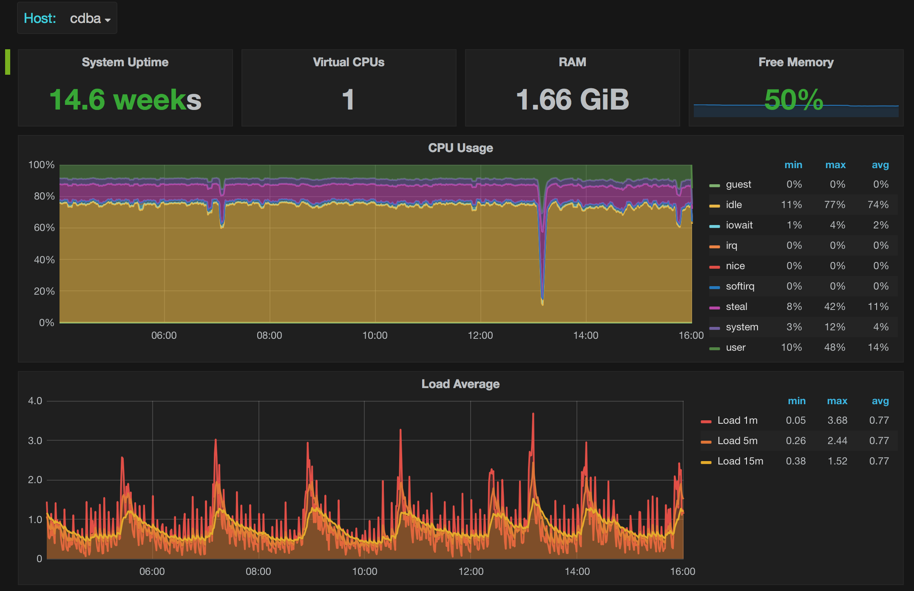

## Grafana dashboards for MySQL and MongoDB monitoring using Prometheus

This is a set of Grafana dashboards for database and system monitoring using Prometheus datasource.

 * Amazon RDS OS metrics (CloudWatch datasource)
 * Cross Server Graphs
 * Disk Performance
 * Disk Space
 * MariaDB
 * MongoDB Cluster Summary
 * MongoDB Overview
 * MongoDB ReplSet
 * MongoDB RocksDB
 * MongoDB WiredTiger
 * MongoDB MMAPv1 
 * MySQL InnoDB Metrics
 * MySQL InnoDB Metrics Advanced
 * MySQL MyISAM Metrics
 * MySQL Overview
 * MySQL Performance Schema
 * MySQL Query Response Time
 * MySQL Replication
 * MySQL Table Statistics
 * MySQL TokuDB Graphs
 * MySQL User Statistics
 * PXC/Galera Cluster Overview
 * PXC/Galera Graphs
 * Prometheus
 * ProxySQL Overview
 * Summary Dashboard
 * System Overview
 * Trends Dashboard

These dashboards are also a part of [Percona Monitoring and Management](https://www.percona.com/doc/percona-monitoring-and-management/index.html) project.

Live demo is available at https://pmmdemo.percona.com/graph/

### Setup instructions

#### Add datasource in Grafana

The datasource should be named `Prometheus` so it is automatically picked up by the graphs.

#### Prometheus config

The dashboards use built-in `instance` label to filter on individual hosts.
It is recommended you give the good names to your instances. Here is some example:

    scrape_configs:
      - job_name: prometheus
        static_configs:
          - targets: ['localhost:9090']
            labels:
              instance: prometheus

      - job_name: linux
        static_configs:
          - targets: ['192.168.1.7:9100']
            labels:
              instance: db1

      - job_name: mysql
        static_configs:
          - targets: ['192.168.1.7:9104']
            labels:
              instance: db1

How you name jobs is not important. However, "Prometheus" dashboard assumes the job name is `prometheus`.

#### Exporter options

Here is the minimal set of options for the exporters:

 * node_exporter: `-collectors.enabled="diskstats,filefd,filesystem,loadavg,meminfo,netdev,stat,time,uname,vmstat"`
 * mysqld_exporter: `-collect.binlog_size=true -collect.info_schema.processlist=true`
 * mongodb_exporter: the defaults are fine.

#### Edit Grafana config

Enable JSON dashboards by uncommenting those lines in `grafana.ini`:

    [dashboards.json]
    enabled = true
    path = /var/lib/grafana/dashboards

If you wish you may import the individual dashboards via UI and ignore this and the next two steps.

#### Install dashboards

    git clone https://github.com/percona/grafana-dashboards.git
    cp -r grafana-dashboards/dashboards /var/lib/grafana/

#### Restart Grafana

    service grafana-server restart

#### Apply patch (only Grafana 3.x)

If you are using Grafana 3.x you need to apply a small patch on your installation to allow the interval template variable in `Step` field of graph editor page
to get the good zoomable graphs. For more information, take a look at [PR#5839](https://github.com/grafana/grafana/pull/5839).

    sed -i 's/expr=\(.\)\.replace(\(.\)\.expr,\(.\)\.scopedVars\(.*\)var \(.\)=\(.\)\.interval/expr=\1.replace(\2.expr,\3.scopedVars\4var \5=\1.replace(\6.interval, \3.scopedVars)/' /usr/share/grafana/public/app/plugins/datasource/prometheus/datasource.js
    sed -i 's/,range_input/.replace(\/"{\/g,"\\"").replace(\/}"\/g,"\\""),range_input/; s/step_input:""/step_input:this.target.step/' /usr/share/grafana/public/app/plugins/datasource/prometheus/query_ctrl.js

### Update instructions

Simply copy the new dashboards to `/var/lib/grafana/dashboards` and restart Grafana or re-import them.

### Graph samples

Here is some sample graphs.

