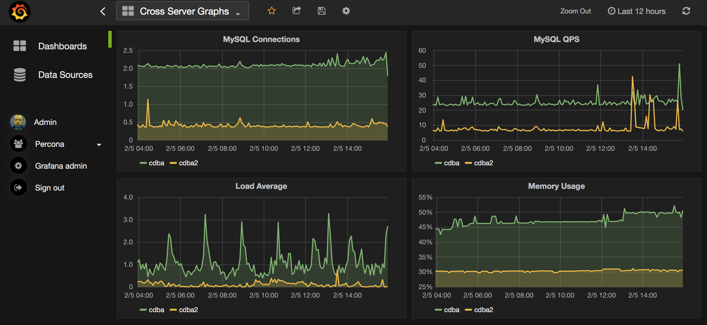

## Grafana dashboards for measuring MySQL performance with Prometheus

This is a set of Grafana dashboards for MySQL and system monitoring to be used with Prometheus datasource.
The dashboards rely on `alias` label in the Prometheus config and depend from the small patch applied on Grafana.

 * Cross Server Graphs
 * Disk Performance (Grafana 3.0+)
 * Disk Space (Grafana 3.0+)
 * Galera Graphs
 * MySQL InnoDB Metrics
 * MySQL InnoDB Metrics Advanced
 * MySQL MyISAM Metrics
 * MySQL Overview
 * MySQL Performance Schema
 * MySQL Query Response Time
 * MySQL Replication
 * MySQL Table Statistics
 * MySQL User Statistics
 * Prometheus
 * Summary Dashboard
 * System Overview
 * TokuDB Graphs
 * Trends Dashboard

These dashboards are also a part of [Percona Monitoring and Management](https://www.percona.com/doc/percona-monitoring-and-management/index.html) project and [Percona App](https://grafana.net/plugins/percona-percona-app) for Grafana.

Live demo is available at http://pmmdemo.percona.com/graph/

### Setup instructions

#### Add datasource in Grafana

The datasource should be named `Prometheus` so it is automatically picked up by the graphs.

#### Edit Prometheus config

The dashboards use `alias` label to work with individual hosts.
Ensure you have `alias` defined for each of your targets.
For example, if you want to monitor `192.168.1.7` the excerpt of the config will be look like this:

    scrape_configs:
      - job_name: prometheus
        target_groups:
          - targets: ['localhost:9090']

      - job_name: linux
        target_groups:
          - targets: ['192.168.1.7:9100']
            labels:
              alias: db1

      - job_name: mysql
        target_groups:
          - targets: ['192.168.1.7:9104']
            labels:
              alias: db1

Note, adding a new label to the existing Prometheus instance will introduce a mess with the time-series.
So it is recommended to start using `alias` from scratch.

How you name jobs is not important. However, "Prometheus" dashboard assumes the job name is `prometheus`.

Also it is assumed that the exporters are run at least with this minimal set of options:

 * node_exporter: `-collectors.enabled="diskstats,filesystem,loadavg,meminfo,netdev,stat,time,uname,vmstat"`
 * mysqld_exporter: `-collect.binlog_size=true -collect.info_schema.processlist=true`

#### Edit Grafana config

Enable JSON dashboards by uncommenting those lines in `grafana.ini`:

    [dashboards.json]
    enabled = true
    path = /var/lib/grafana/dashboards

If you wish you may import the individual dashboards via UI and ignore this and the next steps.

#### Apply Grafana patch

It is important to apply the following minor patch on your Grafana installation in order to use the interval template variable to get the good zoomable graphs. The fix is simply to allow variable in Step field of graph editor page. For more information, take a look at [PR#3757](https://github.com/grafana/grafana/pull/3757) and [PR#4257](https://github.com/grafana/grafana/pull/4257).

Grafana 2.6.0:

    sed -i 's/step_input:""/step_input:c.target.step/; s/ HH:MM/ HH:mm/; s/,function(c)/,"templateSrv",function(c,g)/; s/expr:c.target.expr/expr:g.replace(c.target.expr,c.panel.scopedVars)/' /usr/share/grafana/public/app/plugins/datasource/prometheus/query_ctrl.js
    sed -i 's/h=a.interval/h=g.replace(a.interval, c.scopedVars)/' /usr/share/grafana/public/app/plugins/datasource/prometheus/datasource.js

Grafana 3.0.x:

    sed -i 's/expr=\(.\)\.replace(\(.\)\.expr,\(.\)\.scopedVars\(.*\)var \(.\)=\(.\)\.interval/expr=\1.replace(\2.expr,\3.scopedVars\4var \5=\1.replace(\6.interval, \3.scopedVars)/' /usr/share/grafana/public/app/plugins/datasource/prometheus/datasource.js
    sed -i 's/,range_input/.replace(\/"{\/g,"\\"").replace(\/}"\/g,"\\""),range_input/; s/step_input:""/step_input:this.target.step/' /usr/share/grafana/public/app/plugins/datasource/prometheus/query_ctrl.js

Those changes are idempotent and do not break anything.

#### Install dashboards

    git clone https://github.com/percona/grafana-dashboards.git
    cp -r grafana-dashboards/dashboards /var/lib/grafana/

#### Restart Grafana

    service grafana-server restart
 
### Update instructions

Simply copy the new dashboards to `/var/lib/grafana/dashboards` and restart Grafana.

### Graph samples
 
Here is some sample graphs.

