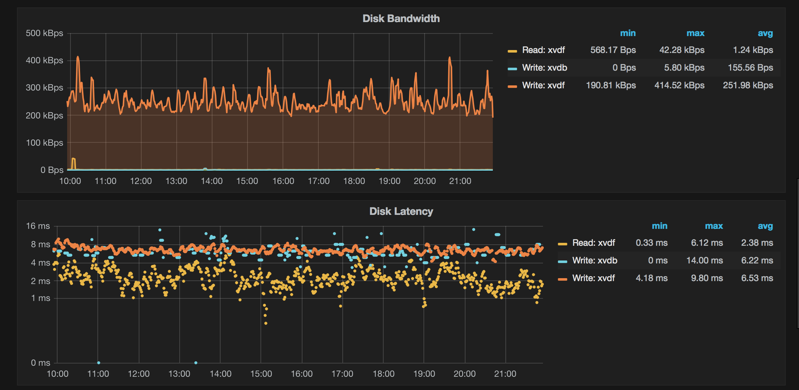

# Grafana dashboards with Prometheus for MySQL

This is a set of Grafana dashboards to be used with Prometheus datasource for MySQL and system monitoring.
The dashboards rely on `alias` label in your Prometheus config. 

 * Cross Server Graphs
 * Disk Performance
 * Galera Graphs
 * MySQL InnoDB Metrics
 * MySQL MyISAM Metrics
 * MySQL Overview
 * MySQL Query Response Time Histograms
 * MySQL Replication
 * MySQL Table Statistics
 * MySQL User Statistics
 * System Overview
 * TokuDB Graphs

### Setup instructions

#### Add datasource in Grafana

#### Edit Prometheus config

The dashboards use `alias` label to work with individual hosts.
Ensure you have `alias` defined for each of your targets.
For example, if you want to monitor `192.168.56.107` the excerpt of the config will be look like this: 

    scrape_configs:
      - job_name: mysql
        target_groups:
          - targets: ['192.168.56.107:9104']
            labels:
              alias: myhost1
    
      - job_name: linux
        target_groups:
          - targets: ['192.168.56.107:9100']
            labels:
              alias: myhost1

`job_name` is not important.
Note, adding a new label to the existing Prometheus instance will introduce a mess with the time-series.
So it is recommended to start with `alias` from scratch.

#### Edit Grafana config

Enable JSON dashboards by uncommenting those lines in `grafana.ini`:

    [dashboards.json]
    enabled = true
    path = /var/lib/grafana/dashboards

If you wish you may import the individual dashboards via UI and ignore this and the next steps.

#### Install dashboards

    git clone https://github.com/percona/grafana-dashboards.git
    cp -r grafana-dashboards/dashboards /var/lib/grafana/

#### Restart Grafana

    service grafana-server restart
 
### Update instructions

Simply copy the new dashboards to `/var/lib/grafana/dashboards` and restart Grafana.

### Graph samples
 
Here is some sample graphs.

