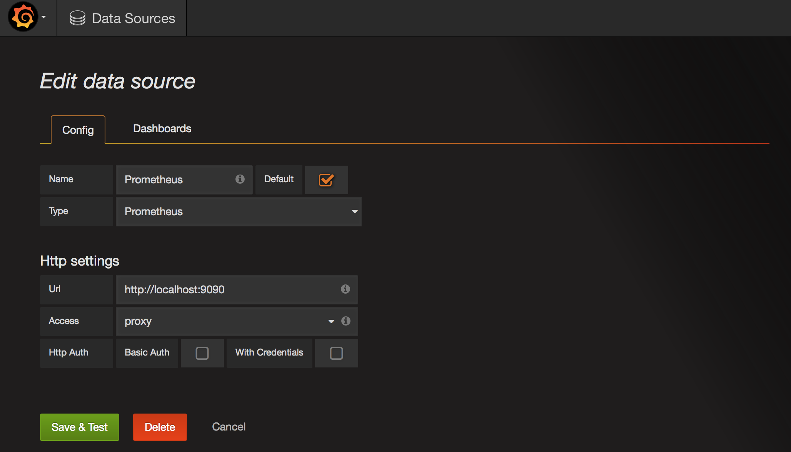
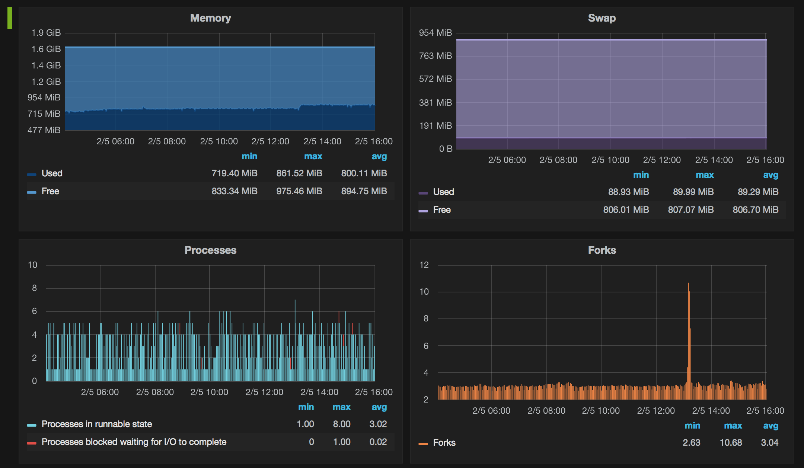
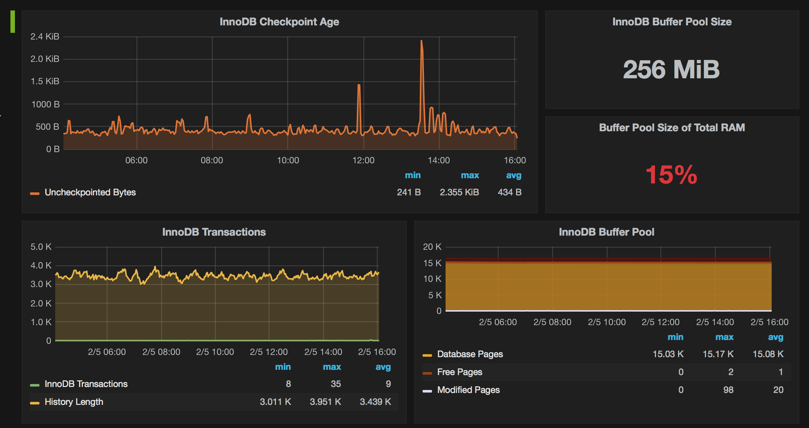
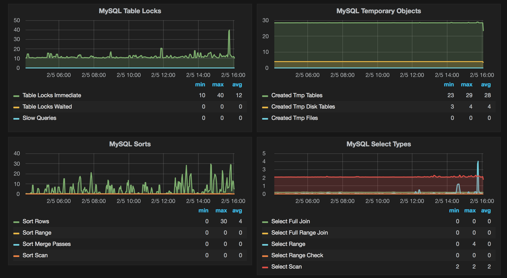
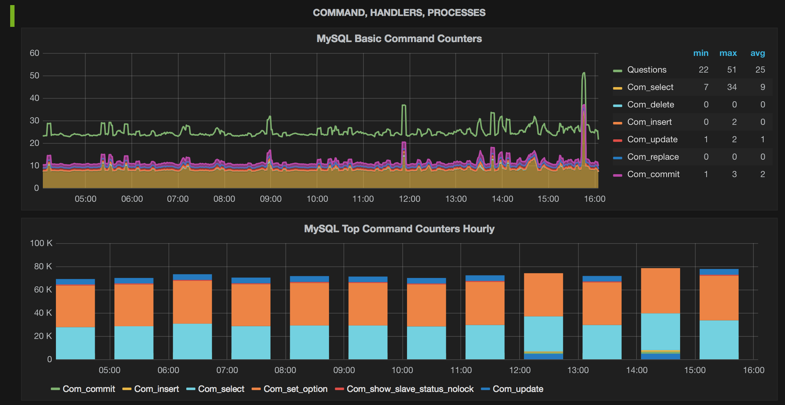

## Grafana dashboards for measuring MySQL performance with Prometheus

This is a set of Grafana dashboards for MySQL and system monitoring to be used with Prometheus datasource.
The dashboards rely on the small patch applied on Grafana.

 * Cross Server Graphs
 * Disk Performance (Grafana 3.0+)
 * Disk Space (Grafana 3.0+)
 * MySQL InnoDB Metrics
 * MySQL InnoDB Metrics Advanced
 * MySQL MyISAM Metrics
 * MySQL Overview
 * MySQL Performance Schema
 * MySQL Query Response Time
 * MySQL Replication
 * MySQL Table Statistics
 * MySQL User Statistics
 * PXC/Galera Cluster Overview
 * PXC/Galera Graphs
 * Prometheus
 * Summary Dashboard
 * System Overview
 * TokuDB Graphs
 * Trends Dashboard

These dashboards are also a part of [Percona Monitoring and Management](https://www.percona.com/doc/percona-monitoring-and-management/index.html) project.

Live demo is available at https://pmmdemo.percona.com/graph/

### Setup instructions

#### Add datasource in Grafana

The datasource should be named `Prometheus` so it is automatically picked up by the graphs.

#### Prometheus config

The dashboards use built-in `instance` label to filter on individual hosts.
It is recommended you give the good names to your instances. Here is some example:

    scrape_configs:
      - job_name: prometheus
        static_configs:
          - targets: ['localhost:9090']
            labels:
              instance: prometheus

      - job_name: linux
        static_configs:
          - targets: ['192.168.1.7:9100']
            labels:
              instance: db1

      - job_name: mysql
        static_configs:
          - targets: ['192.168.1.7:9104']
            labels:
              instance: db1

How you name jobs is not important. However, "Prometheus" dashboard assumes the job name is `prometheus`.

#### Exporter options

Here is the minimal set of options for the exporters:

 * node_exporter: `-collectors.enabled="diskstats,filesystem,loadavg,meminfo,netdev,stat,time,uname,vmstat"`
 * mysqld_exporter: `-collect.binlog_size=true -collect.info_schema.processlist=true`

#### Edit Grafana config

Enable JSON dashboards by uncommenting those lines in `grafana.ini`:

    [dashboards.json]
    enabled = true
    path = /var/lib/grafana/dashboards

If you wish you may import the individual dashboards via UI and ignore this and the next two steps.

#### Install dashboards

    git clone https://github.com/percona/grafana-dashboards.git
    cp -r grafana-dashboards/dashboards /var/lib/grafana/

#### Restart Grafana

    service grafana-server restart

#### Apply Grafana patch

It is important to apply the following small patch on your Grafana installation in order to use the interval template variable to get the good zoomable graphs.
The fix is simply to allow a variable in `Step` field of graph editor page.
For more information, take a look at [PR#5839](https://github.com/grafana/grafana/pull/5839).

Grafana 2.6.0:

    sed -i 's/step_input:""/step_input:c.target.step/; s/ HH:MM/ HH:mm/; s/,function(c)/,"templateSrv",function(c,g)/; s/expr:c.target.expr/expr:g.replace(c.target.expr,c.panel.scopedVars)/' /usr/share/grafana/public/app/plugins/datasource/prometheus/query_ctrl.js
    sed -i 's/h=a.interval/h=g.replace(a.interval, c.scopedVars)/' /usr/share/grafana/public/app/plugins/datasource/prometheus/datasource.js

Grafana 3.x:

    sed -i 's/expr=\(.\)\.replace(\(.\)\.expr,\(.\)\.scopedVars\(.*\)var \(.\)=\(.\)\.interval/expr=\1.replace(\2.expr,\3.scopedVars\4var \5=\1.replace(\6.interval, \3.scopedVars)/' /usr/share/grafana/public/app/plugins/datasource/prometheus/datasource.js
    sed -i 's/,range_input/.replace(\/"{\/g,"\\"").replace(\/}"\/g,"\\""),range_input/; s/step_input:""/step_input:this.target.step/' /usr/share/grafana/public/app/plugins/datasource/prometheus/query_ctrl.js

Grafana 4.x (unreleased):

    There won't be a need to apply this patch.

Those changes are idempotent and do not break anything.

### Update instructions

Simply copy the new dashboards to `/var/lib/grafana/dashboards` and restart Grafana or re-import them.

### Graph samples

Here is some sample graphs.

